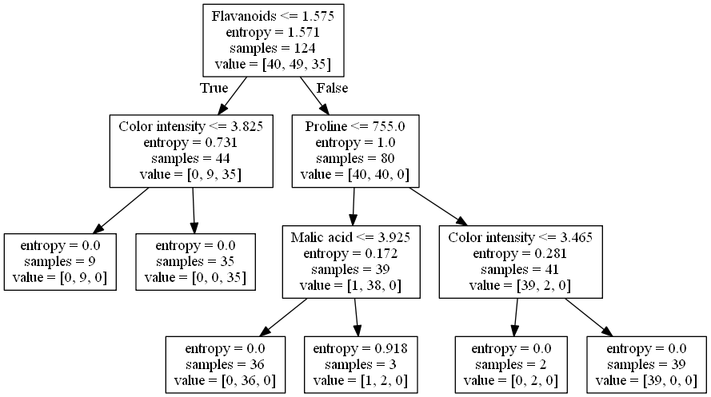
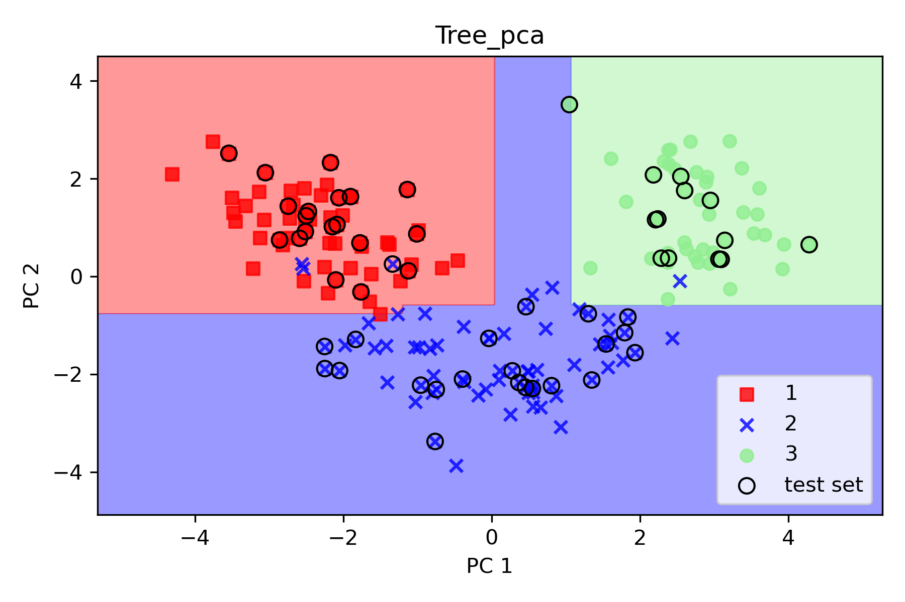
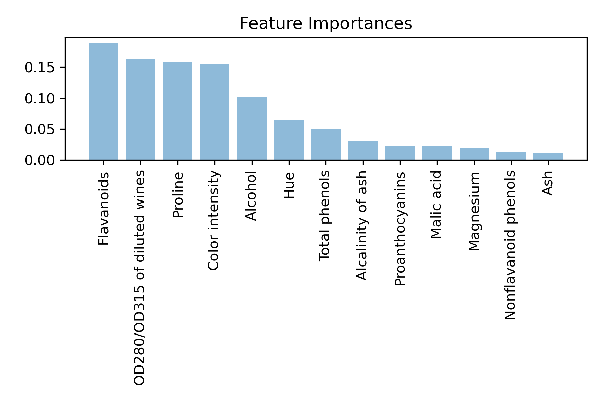

# Random Forest for Wine Dataset: Classification and Feature Importance Analysis

## Overview

This project focuses on the application of Random Forest to the wine dataset for classification and feature importance analysis. The main objective was to develop a high-performing classification model using Random Forest and gain insights into feature importance for better model interpretability.

## Techniques Used

- Random Forest: Utilized Random Forest algorithm for classification tasks on the wine dataset.

- Feature Importance Analysis: Utilized Random Forest to compute feature importance, which helped in performing feature selection and gaining valuable insights into the dataset.

## Key Contributions

1. High Accuracy Classification: Successfully applied Random Forest to achieve high accuracy in classifying the wine dataset, showcasing proficiency in machine learning algorithms.

2. Enhanced Model Interpretability: By computing feature importance, the project contributed to a better understanding of the importance of various features in the dataset, making the model more interpretable.

## Results

The Random Forest model demonstrated impressive accuracy in classifying the wine dataset, making it suitable for various classification tasks. Additionally, the feature importance analysis provided valuable insights into the dataset's characteristics, contributing to a better understanding of the dataset and model interpretability.
